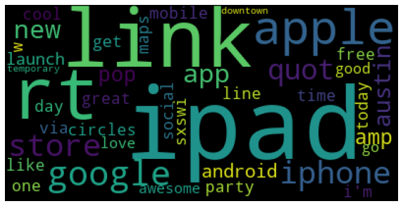
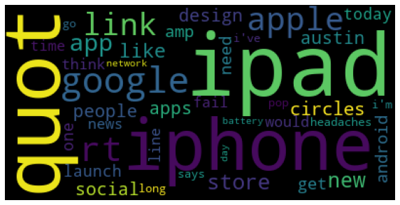
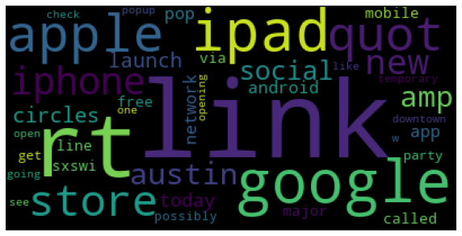
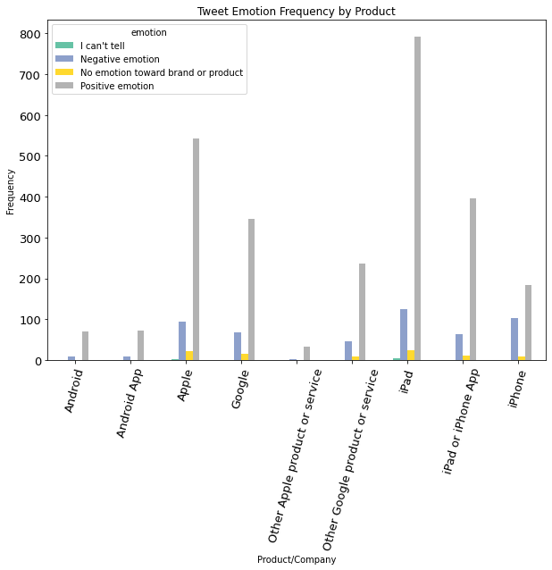
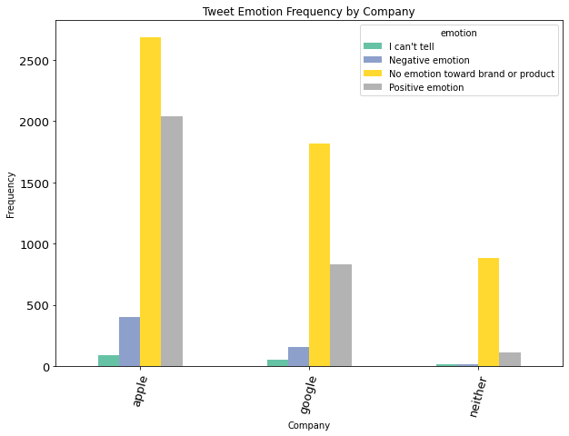
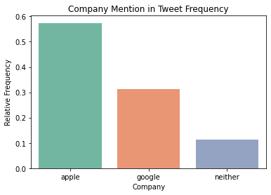
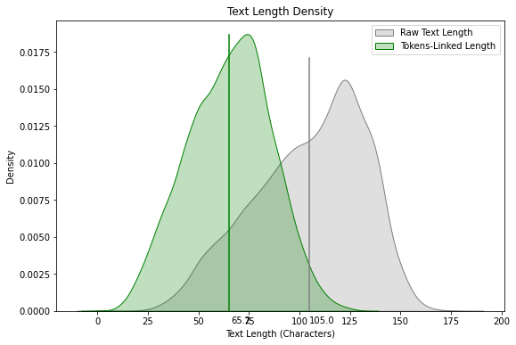
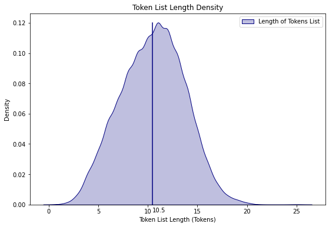

# Sentiment Classification of Tweets about Apple and Google Products README

**Author**: Jake Oddi

## Overview

This project employs NLP and classification methods to classify text data from tweets as having positive, negative, or neutral sentiment. Several NLP preprocessing steps are taken before a Naive-Bayes classifier, Support Vector Machine, Random Forest, and an ensemble of the three are fit to the data to make predictions.

## Business Problem

As social media platforms have increasingly become the main public forum, companies have looked for new ways to derive insights about products and companies. Twitter is one of the largest of such platforms, making it great candidate with which to search for information. Analyzing sentiment regarding products and companies serves as a relatively new way to predict the products or companies that will be successful and those that won't. In addition, in can also serve as a new line to the customer to take feedback about what people liked about a product and what they didn't. Twitter sentiment can also be used to drive investment decisions, with companies that exhibit an increase in postive sentiment over time presumed to be better investments than an equal counterpart with a negative trend in sentiment.

## Data Understanding

The dataset contains 9093 tweets sourced from 2013. It was obtained from [CrowdFlower Open Source Datasets](https://data.world/crowdflower/brands-and-product-emotions) The tweets are are about either Apple or Google or any of their respective products and services. Each tweet is labeled by a human observer to be either 'Positive Sentiment', 'Negative sentiment', 'No emotion toward brand or product', or 'I can't tell.' The third feature that comes with the dataset is a column stating what product the tweet is about, however this proved unreliable on its own.

## Methods

I cleaned the data and engineered a number of features in order to look for insights during the Exploratory Data Analysis(EDA) Process. First I created word clouds for positive, negative, and neutral sentiment, respectively.

Word clouds are a great way to visualize token frequency without using traditional methods such as barplots. In my first iteration of word clouds, the terms 'sxsw' and 'mention' were the two largest for each cloud (as stated above), so I removed them and re-ran the visualization.

#### Product vs Sentiment

I was curious about the kind of positive and negative attention attracted by each product on the individual level, so I made the barplot below to examine.

At a first glance, there seems to be much more positive rating than negative rating within the dataset. iPad and Apple yield the two highest positive sentiment frequencies, while iPad also yields the highest negative sentiment frequency. From this we can deduce that it was mentioned in more tweets than the other products.

#### Company vs Sentiment

Next, I wanted to examine the sentiment based solely on the company, so I created the barplot below.

At a first glance, it would appear that Apple recieves far more positive sentiment than Google. I decided to dig deeper to see if an imbalance in the frequency of Apple and Google tweets could be the cause. I created the plot below to examine the issue.

As shown in the above barplot, it would appear that a tweet-frequency imbalance is the cause of Apple's apparent positivity dominance.

#### Text Length vs Sentiment

I wondered if there was a connection between how long a tweet was and whether it was positive, negative, or neutral. Before that, I wanted to examine the distributions of different variations of tweet-text. I created a KDE plot comparing the mean length of the raw tweets with the mean length of the tokenized tweets to observe the distributions on their own, as well as compared with one another. I then created a third KDE plot to observe the distribution of the length of the tokenized tweets.

The above plot shows the distribution of raw text length to be somewhat left-skewed, with a mean of 105 characters denoted by the grey line. The distribution of the linked tokens is more uniform, skewing only very slightly to the left, and with a mean of 75 characters denoted by the green line.

The length of the original token lists seems to be uniformly distributed with a mean of 12.3 tokens denoted by the blue line.

## Modeling and Results

With the data cleaned and explored and with the features engineered, I proceeded to model the data. First, I split up my data into train and test sets. Then I vectorized my tokens using TF-IDF vectorization, which calculates a score for each word based on its scarcity within each body of text as well as how many texts it appears in. In order for TfidfVectorizer to work on a dataframe, I needed to use my linked tokens instead of the regular list of tokens. Ready to begin modeling, I began with a Support Vector Machine, as they are suited to do well with data with many features and sparse data like text. The shape of the training data is (6819, 8078).

F1-score is used as the primary evaluation metric due to the class imbalance in the target variable. The SVM performed the best of the three, with an F1-score of 0.6579 on the test set. Next was the RFC with 0.6391, then the NB with 0.5922. In general, these scores are nowhere near perfect, however they do demonstrate reasonable performance accross the three models.

Finally, I thought it would be interesting to test the performance of an ensemble of the three models. Furthermore, I wanted to cross-validate my F1-scores to improve their accuracy in measuring performance.

The ensemble method performed worse on the test set (F1-score = 0.6387) than the SVM did; however, this could be due to the fact that I used cross validation with five folds on the ensemble but not the SVM.

## Conclusion and Next Steps

The highest performing model was the Support Vector Machine, though I have more faith in the ensemble of models given it's cross validated.

Given more time, I would have liked to add to this project in the following ways: employ lemmatization for more accurate tokens; explore various text vectorization techniques such as Bag of Words; GridSearch parameters for my models to improve performance; cross validate all models; use deep learning techniques like word embedding and Word2Vec, using a neural network to model sentiment; and use VADER to perform semi-supervised sentiment analysis.

Overall, social media data contains an abundance of useful information and is sure to remain valuable for the foreseeable future. If one were to scrape data from Twitter rather than pull it using their API, a tweet dataset has the potential to grow much larger and provide more powerful insights.